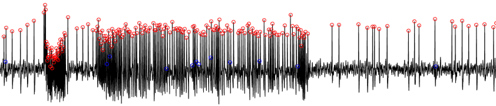
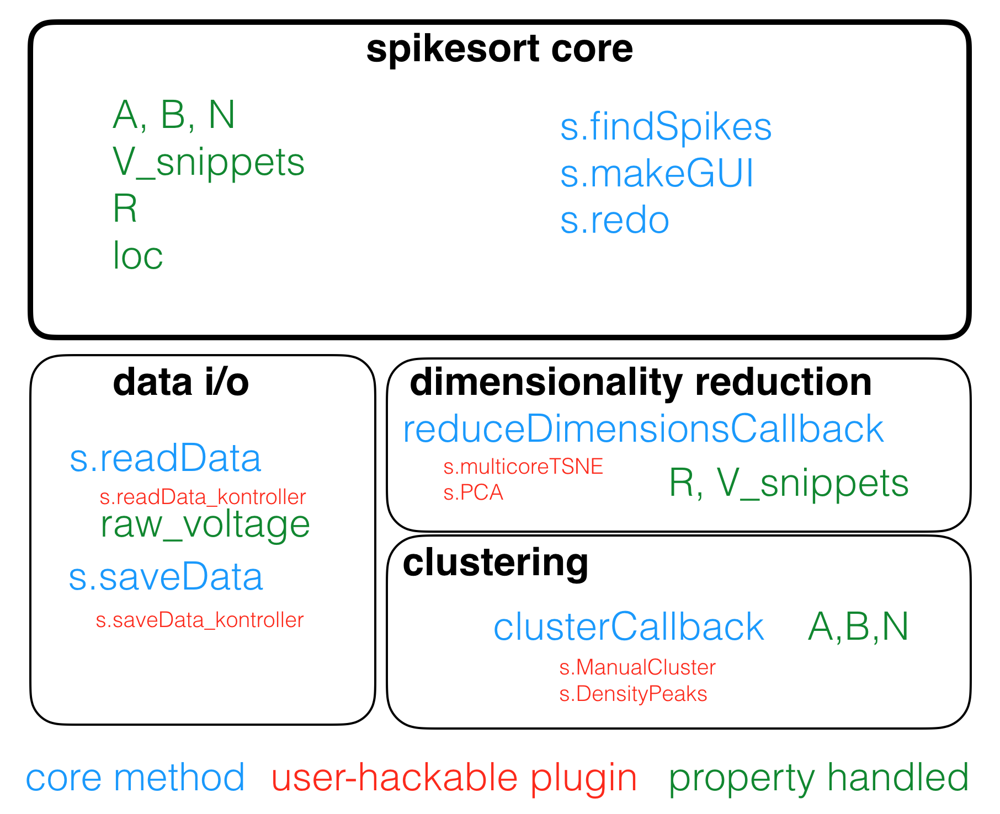

# spikesort

[]()



`spikesort` is a framework written in MATLAB to help you sort spikes from single-channel extracellular recordings. It is 

1. **highly modular** Almost everything is written as a plugin. `spikesort` is a [MATLAB class](https://www.mathworks.com/help/matlab/matlab_oop/classes-in-the-matlab-language.html), and plugins are methods defined within the class. 
2. **Accurate** Using the t-SNE dimensionality reduction algorithm, `spikesort` achieves a 99.5% accuracy on test data. For a full report, see [this](https://github.com/sg-s/spikesort/blob/master/tests/html/makeTestReport.pdf). 
3. **Data-agnostic** `spikesort` interfaces to your data through plugins, and `spikesort` doesn't care what your data format is.
4. **Bring-your-own-algorithm** `spikesort` splits up the spike sorting problem into two steps: dimensionality reduction and clustering. Every algorithm in either step is written as a plugin, and you can write your and drop it in, with *zero* modifications to the core code. For example, `spikesort` can use the amazing [mutli-core t-SNE algorithm](https://github.com/DmitryUlyanov/Multicore-TSNE) to embed spike shapes in two dimensions *very* rapidly. 

## Installation

`spikesort` is written in MATLAB, with a sprinkling of Python wrapper code. It should work on any OS that modern MATLAB runs on, but has only been tested on macOS Sierra with MATLAB R2015a. 

The best way to install `spikesort` is through my package manager: 

```
% copy and paste this code in your MATLAB prompt
websave('install.m','https://git.io/viWvp')
install sg-s/spikesort
install sg-s/srinivas.gs_mtools   % spikesort needs this package to run
```

This script grabs the code and fixes your path. 

Or, if you have `git` installed:

````
git clone git@github.com:sg-s/spikesort.git
````

Don't forget to download, install and configure the other packages too (see below). 

### install [bhtsne](https://github.com/lvdmaaten/bhtsne) 

If you used `install.m` to install spikesort, you already have these toolbox. However, you need to compile to run. On *nix-like systems, navigate to the folder it is in (should be `~/code/bhtsne/`) and run the following:

```
g++ sptree.cpp tsne.cpp -o bh_tsne -O2
```

Note that my fork of `bhtsne` may have modifications, and this is what you should use with `spikesort`. If you're running Windows, you need to use whatever compiler you have to compile this. See [this](https://github.com/sg-s/bhtsne) for instructions on how to build the binary.


### install [Multicore-TSNE](https://github.com/DmitryUlyanov/Multicore-TSNE)

This implementation of t-SNE is the the fastest I know of, and gets faster the more cores you throw at it. Follow the installation instructions [here](https://github.com/DmitryUlyanov/Multicore-TSNE#install). macOS users, [see this](https://github.com/DmitryUlyanov/Multicore-TSNE/issues/1#issuecomment-262938483) for installation troubleshooting. 

You then need to tell MATLAB where `Multicore-TSNE` is installed. To do this, 

1. first determine where it is installed (`pip show MulticoreTSNE`)
2. Copy and paste this code to your MATLAB `startup.m` (use `edit startup.m`)

```matlab
a_path = '/path/to/MulticoreTSNE';
path1 = getenv('PATH');
if isempty(strfind(path1,[pathsep a_path]))
    path1 = [a_path pathsep path1];
end
setenv('PATH', path1);
```

## Limitations and Scope

* sorting into only two neurons/units (A and B) is supported. spikesort will *not* support more than 2 units in the anticipated future. 
* Only 1 recording electrode is supported at a time. No support for multi-electrode arrays, nor will `spikesort` ever have support for MEAs. 


## Architecture



`spikesort` is built around a plugin architecture for the three most important things it does: 

* Data handling
* Dimensionality reduction of spike shapes
* Clustering 

### Writing your own plugins

Writing your own plugins is really easy: plugins are methods that you can simply drop into the `spikesort` classdef folder (`@spikesort`), and `spikesort` automatically figures out which methods are plugins (see naming convention below)

#### Naming and Plugin declaration
Plugins can be named whatever you want, though you are encouraged to use `camelCase` for all methods. The first three lines of every plugin should conform to the following convention:

```matlab
% spikesort plugin
% plugin_type = 'dim-red';
% plugin_dimension = 2; 
% 

```

The first line identifies the method as a `spikesort` plugin, and the second line determines the type of plugin it is. Currently, plugins can be of six types:

1. `dim-red`
2. `cluster`
3. `read-data`
4. `save-data`
5. `load-file`
6. `plot`

If you are writing a `read-data`, `save-data`,`load-file` or `plot` plugin, the convention for the first three lines is as follows:

 ```matlab
% spikesort plugin
% plugin_type = 'load-file';
% data_extension = 'kontroller'
% 
```
`data_extension` identifies the extension that `spikesort` binds that plugin to. 

`load-file` plugins are expected to populate the following fields in the `spikesort` object:

```
output_channel_names
sampling_rate
this_trial
this_paradigm
handles.paradigm_chooser.String
```
`plot-spikes` plugins are expected to read all spikes in that data file, and make a raster or a firing rate plot, with appropriate labels for each trial and paradigm set. 

# License 

[GPL v3](http://gplv3.fsf.org/)

If you plan to use `spikesort` for a publication, please [write to me](http://srinivas.gs/#contact) for appropriate citation. 

