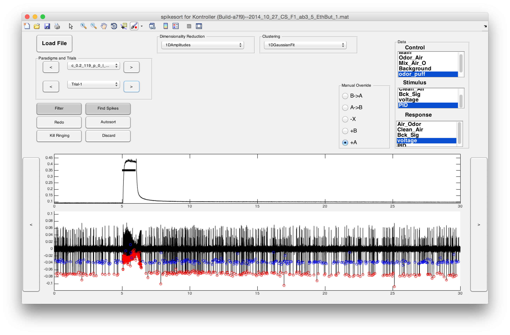
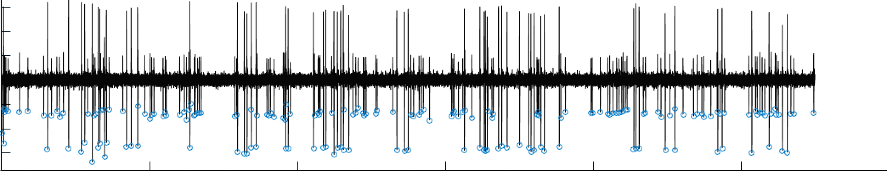
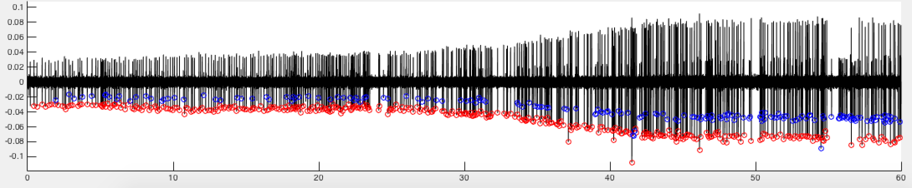
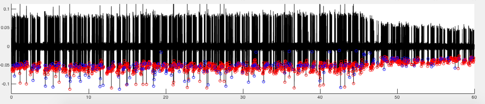

# spikesort

Spike sorting for Kontroller



`spikesort` can read data generated by [Kontroller](https://github.com/sg-s/kontroller) and help you sort spikes from multiple neurons in a single extracellular voltage recording. This was developed for sorting the action potentials of Drosophila Olfactory Receptor Neurons, but would probably work in other contexts. 

## Features

### Fast Filter and Find Spikes in trace



### Several algorithms for dimensional reduction

Every problem is different. To deal with unknown unknowns, `spikesort` ships with a number of methods for dimensionality reduction. All these methods are built around an awesome [plugin](#plugin-architecture) architecture, making inclusion of new methods a breeze.  

Here is an example where the `relative amplitudes` method dealt easily with an error in recording that causes all spike amplitudes to change over time:



And here is another example showing how the `normalised PCA` method deals with an even more complex problem:



`spikesort` ships with the following dimensionality reduction algorithms:

1. Spike Amplitudes
2. Fractional Spike Amplitudes 
3. Relative Spike Amplitudes 
4. Fractional Amplitudes and Inter-Spike Intervals 
5. Principal Components Analysis 
6. Normalised PCA

### Several algorithms for data clustering

Likewise, data clustering is achieved through plugins, allowing you to customise `spikesort` for any task. Out of the box, `spikesort` supports the following clustering algorithms: 

1. k-means
2. 1D Gaussian Clustering
3. 2D Manual Clustering 

All these methods are built around an awesome [plugin](#plugin-architecture) architecture, making inclusion of new clustering methods **very** easy. 

### SmartScroll

When SmartScroll is enabled, `spikesort` will keep a constant number of spikes in view. This is perfect for closely examining a time series with fluctuating firing rates, and displaying spikes in an optimal manner. 

### Native support for [Kontroller](https://github.com/sg-s/kontroller)-generated data


### export all traces to EPS figures.

### Tag files on UNIX systems

`spikesort` supports the awesome [tag](https://github.com/jdberry/tag) command line file-tagging utility, allowing you to arbitrarily tag files with as many tags as you want.

## Limitations 

* for various reasons, sorting into only two groups (A and B) is supported. spikesort will not support more than 2 groups in the anticipated future. 
* Only 1 recording electrode is supported at a time. No support for multi-electrode arrays, nor will spikesort ever have support for MEAs. 

## Installation

spikesort is written in MATLAB.

The best way to install spikesort is through my package manager: 

```
>> urlwrite('http://srinivas.gs/install.m','install.m'); 
>> install spikesort
>> install srinivas.gs_mtools # spikesort needs this package to run
>> install kontroller # needs a few functions from this package
```

This script grabs the code and fixes your path. 

Or, if you have `git` installed:

````
git clone git@github.com:sg-s/spikesort.git
````

or use [this link](https://github.com/sg-s/spikesort/archive/master.zip). Don't forget to install the other packages too. 

### install tag

On Mac OS X, `spikesort` supports file tagging. To get this working, you need to have [homebrew](http://brew.sh) installed. You can then install `tag` using

````
brew install tag
````

# Hacking

## Plugin architecture

`spikesort` is built around a plugin architecture for the two most important things it does: 

* dimensionality reduction of spike shapes
* clustering 

### Writing your own plugins

Writing your own plugins is really easy: `spikesort` does the heavy lifting in figuring out how to talk to it, and all you have to is write a function that conforms to a few standards:

#### Naming
Dimensionality reduction plugins have to be called `ssdm_foo.m` and clustering method plugins have to be called `sscm_bar.m`. Put them in the same folder as 	`spikesort` and it will automatically include them. 

#### Outputs
A dimensionality reduction plugin is a function must return a variable called `R`, that is usually a vector or a matrix (but can be whatever you want)

A clustering plugin is a function that must return two variables `A` and `B` that indicate vector indices of spikes of neuron 1 and neuron 2 in the current voltage trace. 

#### Inputs
Both types of plugins are functions that can have any inputs whatsoever -- provided you reference the correct variable names in spikesort. Since `V` is a variable used to denote the filtered voltage in `spikesort`, you can ask for `V` in your function definition as follows:

```
function R = ssdm_my_awesome_plugin(V,foo,bar)
```

and `spikesort` will intelligently give your function the correct variables in the correct order (spikesort reads your function and figures this out). So you can write plugins that work with any variable in the main `spikesort` codebase without altering it in any way.

#### Variable Names

This powerful input architecture means you need to know what variables are called in the `spikesort` codebase. You should read the code. Here is a non-exhaustive list of some useful internal variables that `spikesort` uses that you might want to use in your plugin:

* `V` a vector, contains the raw voltage trace
* `Vf` a vector, contains the filtered voltage trace
* `loc` a vector, contains the vector indices of putative spikes
* `ax`, `ax2` handles to the two main axes. Useful if your plugin does some fancy plotting.  
* `V_snippets` a matrix containing snippets around `loc` from `Vf`. Useful if you just want to work with the spike shapes, and don't really care where they are. 

#### Function Summary


# License 

[GPL v2](http://choosealicense.com/licenses/gpl-2.0/#)

