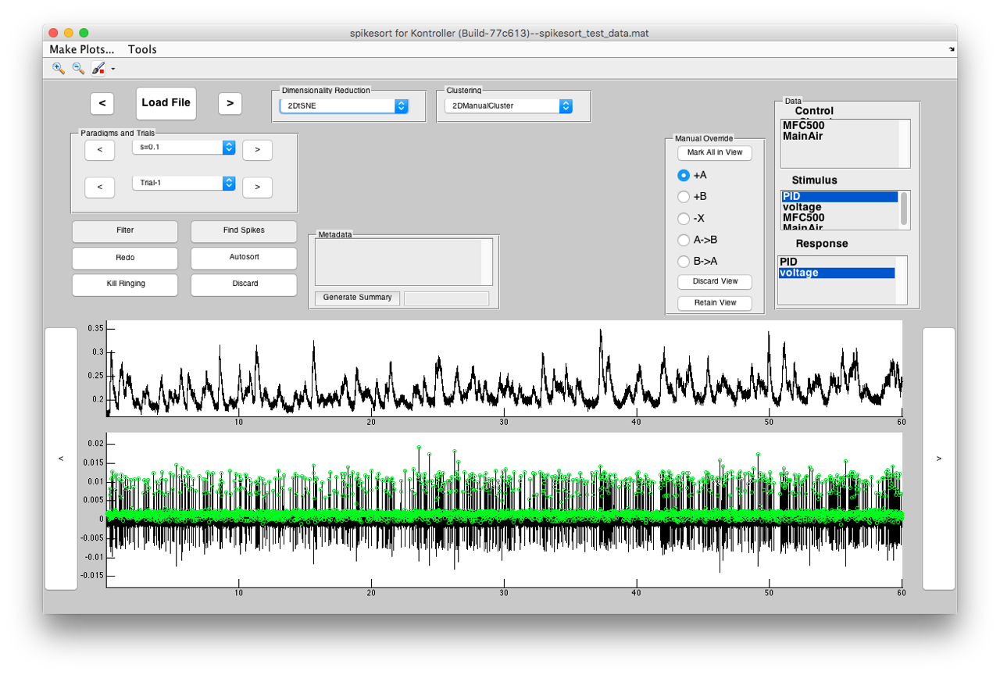
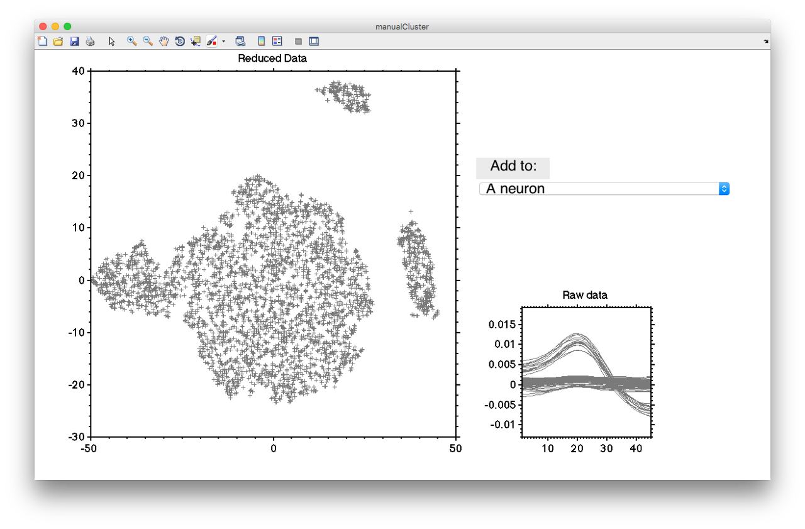
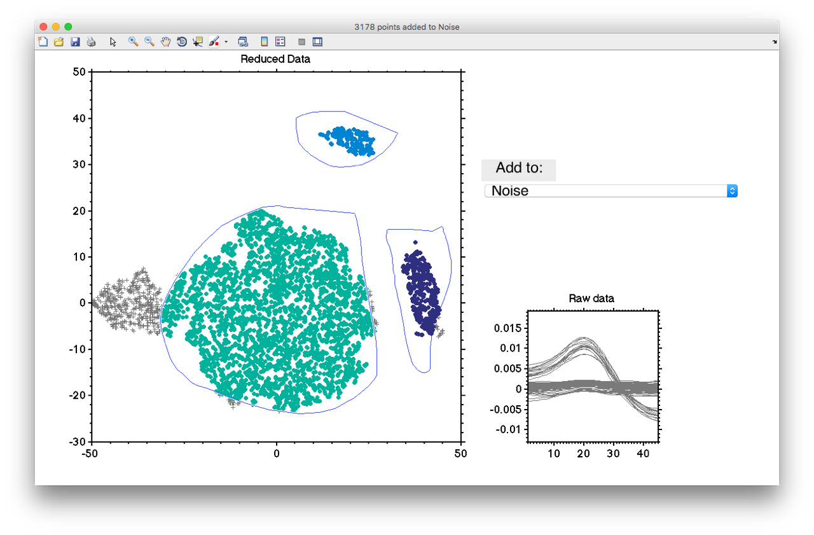
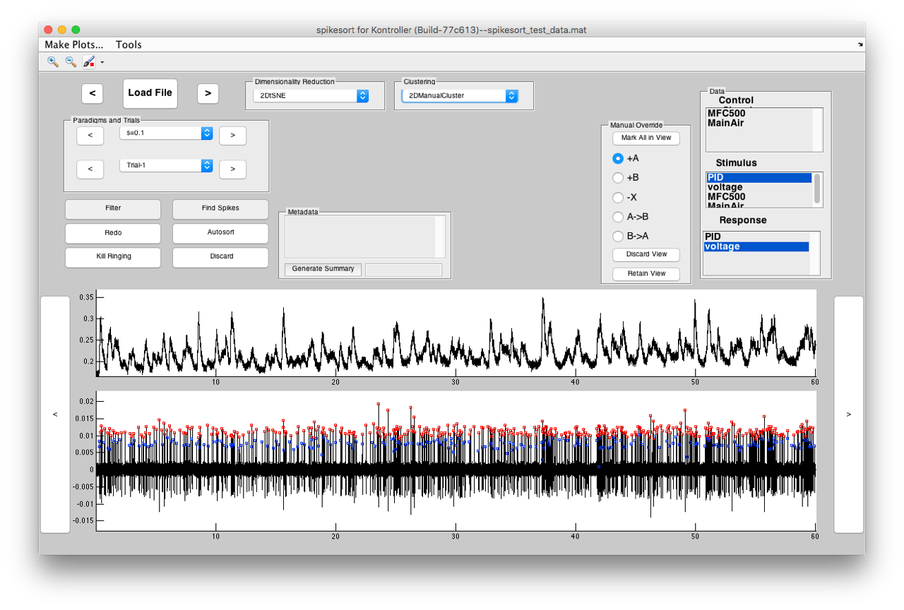

# How to use spikesort

This document tells you how to use spikesort. It is a GUI only package, meaning you can only use it from the GUI. Automation is limited to what you can do from the GUI. 

# The preferences file

spikesort has a lot of preferences, and all of them are in a text file called `pref.m`, that you can edit. For example, part of it looks like this:

```matlab

%% ~~~~~~~~~~~~~~~~~  DATA  ~~~~~~~~~~~~~~~~~~~~~~~~~~~~~~

deltat = 1e-4; % what is the time step of the data?


%% ~~~~~~~~~~~~~~~~~  GENERAL  ~~~~~~~~~~~~~~~~~~~~~~~~~~~~~~

ssDebug = false; 			% should spikesort run in debug mode?
useFastBandPass = true; 	% use a fast, FFT-based bandPass? 

%% ~~~~~~~~~~~~~~~~~  DISPLAY  ~~~~~~~~~~~~~~~~~~~~~~~~~~~~~~

% display preferences
marker_size = 5; 			% how big the spike indicators are
show_r2 = false;			% show r2 in firing rate plot
fs = 14; 					% UI font size
fw = 'bold'; 				% UI font weight
plot_control = true; 		% should spikesort plot the control signals instead of the stimulus?


```

spikesort reads `pref.m` and uses these preferences. If you want to change the preferences while working with data, you can do so without rebooting spikesort. Just change whatever you want in pref.m, and use `Tools > Reload preferences`. 

# The Main workflow

spikesort automatically finds peaks using the `findpeaks` function built into MATLAB. It uses prominence peak detection, and the parameters of peak detection are tweakable in the preferences file. 

At its core, spikesort is a facilitator wrapper for two central tasks: 

1. dimensionality reduction and
2. clustering 

Selecting a method for dimensionality reduction (e.g., PCA), applies that method on all detected spikes, and you are now ready to cluster your data. 

The main cluster method is a manual clustering toolbox that lets you pick the clusters (usually noise, A neuron and B neuron). Once you're done with that, spikesort applies this sorting, and then resolves some spike doublets based on inter-spike intervals (you can't have two spikes from the same neuron too close together). These parameters are also tunable in the `pref.m` file. 

# Manual Override

Based on the data, this sorting will be anywhere from perfect to rubbish. You can override each spike, or blocks of spikes, using the Manual Override box. It's pretty self-explanatory: 

1. pick "+A" to mark a unlabeled peak as a A spike.  
2. pick "+B" to mark a unlabeled peak as a B spike.  
3. pick "-X" to remove a labeled peak 

and so on. 

# A special note about t-SNE

The most powerful dimensionality reduction algorithm spikesort comes with is the t-SNE visualization technique. Unfortuantely, for typical data that spikesort is built for, t-SNE is very slow (~1m a 1m-long trial), and gets slower with more detected peaks. To work around this, spikesort comes with a function called `preCachetSNE` that detects peaks, runs t-SNE on the data, and caches the embedding so you can instantly view it when you go through the data sorting spikes. 

The expected workflow for t-SNE sorting is as follows:

1. determine if you want to find peaks in negative or positive V (look at your traces) 
2. tune your spike detection parameters so you find every spike (I find that t-SNE works well even if ~90% of your detected peaks are noise, as long as you managed to get every single spike)
3. Save your `pref.m` file
4. run `preCachetSNE` on the folder with your data.
5. Sort the spikes using t-SNE. The embedding should appear instantly. This works because `spikesort` leverages [cache.m](https://github.com/sg-s/srinivas.gs_mtools/blob/master/docs/cache.md) to build a hash-based cache of the t-SNE embeddings. 

# A Working Example

This section provides a brief overview of how to use the spikesort package by stepping through a working example, images showing expected outputs are also included.

### Load the data

1. Run `spikesort` from the MATLAB command line
2. Click *Load File*
3. Select the data file from the pop-up window (should be a .mat file in [kontroller](https://github.com/sg-s/kontroller) format)

If the data file you have uploaded is in the correct format, you will see the following window showing the voltage trace and transformed spike data trace. The purple points indicate spikes.


### Apply a dimensionality reduction technique

1. Use the drop-down menu to select a dimensionality technique (for example 2DtSNE)
2. Wait while the program runs the selected algorithm

The spike data plot will now show green highlights indicating the data points to be separated into their respective groups.



### Apply a clustering method

1. Use the drop-down menu to select a clustering method (for example `2DManualCluster`)
2. A pop-up will be presented, showing the cluster of spikes
3. Use the drop-down menu to select the group to which the cluster of spikes will be grouped into
4. Drag a line around the clusters
5. Repeat as neccessary
6. Once all spike clusters have been grouped, close the window

`spikesort` accordingly sorts the spikes into their respective groups in the spike data plot. By selecting either Neuron A or Neuron B, `spikesort` tags the spikes as red or blue. The cluster of spikes grouped as noise will accordingly be removed from the spike data plot.





### Output

The resulting spike data plot will be saved into a new variable `spikes`, which corresponds one-to-one with the data stored in `data`. 